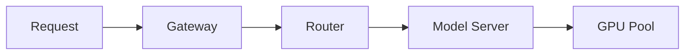

Convert a presentation outline into Marp markdown format with Red Hat visual identity, ready to render and present without cleanup.

The user will provide an existing presentation outline. Use the following input: $ARGUMENTS

If no outline is provided in the arguments, ask the user to paste their slide outline or provide a file path.

## Instructions

Transform the provided outline into valid Marp markdown. The output must be copy-paste ready: renderable with Marp CLI or Marp VS Code extension with zero edits beyond swapping in real images.

### Marp Front Matter and Custom Theme

Start every deck with this front matter and embedded theme. Fill in the bracketed values from the outline.

```yaml
---
marp: true
theme: default
paginate: true
header: "[Presentation Title]"
footer: "[Speaker Name] | [Event Name] | [Date]"
style: |
  @import url('https://fonts.googleapis.com/css2?family=Red+Hat+Display:wght@400;700;900&family=Red+Hat+Text:wght@400;500;700&family=Red+Hat+Mono:wght@400;700&display=swap');

  :root {
    --rh-red: #EE0000;
    --rh-red-dark: #A30000;
    --rh-dark: #151515;
    --rh-gray-light: #F5F5F5;
    --rh-gray-mid: #6A6E73;
    --rh-white: #FFFFFF;
  }

  section {
    font-family: 'Red Hat Text', sans-serif;
    font-size: 28px;
    color: var(--rh-dark);
    background: var(--rh-white);
    padding: 60px 80px;
  }

  h1 {
    font-family: 'Red Hat Display', sans-serif;
    font-weight: 900;
    font-size: 2.4em;
    color: var(--rh-red);
    border-bottom: 3px solid var(--rh-red);
    padding-bottom: 0.2em;
  }

  h2 {
    font-family: 'Red Hat Display', sans-serif;
    font-weight: 700;
    font-size: 1.8em;
    color: var(--rh-dark);
  }

  h3 {
    font-family: 'Red Hat Display', sans-serif;
    font-weight: 700;
    font-size: 1.3em;
    color: var(--rh-gray-mid);
  }

  code {
    font-family: 'Red Hat Mono', monospace;
    background: var(--rh-gray-light);
    padding: 2px 8px;
    border-radius: 4px;
    font-size: 0.9em;
  }

  pre code {
    background: var(--rh-dark);
    color: #E0E0E0;
    padding: 24px;
    border-radius: 8px;
    font-size: 0.75em;
    line-height: 1.5;
  }

  blockquote {
    border-left: 6px solid var(--rh-red);
    padding-left: 24px;
    font-size: 1.4em;
    font-weight: 700;
    font-family: 'Red Hat Display', sans-serif;
    color: var(--rh-dark);
    margin: 40px 0;
  }

  a {
    color: var(--rh-red);
    text-decoration: none;
    font-weight: 500;
  }

  ul, ol {
    line-height: 1.7;
    font-size: 0.95em;
  }

  li {
    margin-bottom: 0.4em;
  }

  table {
    font-size: 0.85em;
    border-collapse: collapse;
    width: 100%;
  }

  th {
    background: var(--rh-red);
    color: var(--rh-white);
    font-family: 'Red Hat Display', sans-serif;
    padding: 12px 16px;
    text-align: left;
  }

  td {
    padding: 10px 16px;
    border-bottom: 1px solid #D2D2D2;
  }

  /* Title/lead slide */
  section.lead {
    text-align: center;
    display: flex;
    flex-direction: column;
    justify-content: center;
    align-items: center;
  }

  section.lead h1 {
    border-bottom: none;
    font-size: 3em;
    margin-bottom: 0.1em;
  }

  section.lead h2 {
    color: var(--rh-gray-mid);
    font-weight: 400;
    font-size: 1.3em;
  }

  /* Section divider slide */
  section.divider {
    background: var(--rh-dark);
    color: var(--rh-white);
    display: flex;
    flex-direction: column;
    justify-content: center;
    padding: 80px 100px;
  }

  section.divider h1 {
    color: var(--rh-white);
    border-bottom: 3px solid var(--rh-red);
    font-size: 2.8em;
  }

  section.divider h2 {
    color: var(--rh-gray-mid);
    font-weight: 400;
  }

  /* Code-focused slide */
  section.code-slide {
    background: var(--rh-dark);
    color: #E0E0E0;
    padding: 40px 60px;
  }

  section.code-slide h2 {
    color: var(--rh-white);
    font-size: 1.4em;
    margin-bottom: 0.3em;
  }

  section.code-slide pre code {
    font-size: 0.8em;
  }

  /* Stats/quote callout slide */
  section.callout {
    display: flex;
    flex-direction: column;
    justify-content: center;
    text-align: center;
    padding: 80px 120px;
  }

  section.callout h1 {
    border-bottom: none;
    font-size: 4em;
    color: var(--rh-red);
    margin-bottom: 0;
  }

  section.callout h2 {
    font-weight: 400;
    color: var(--rh-gray-mid);
    font-size: 1.2em;
  }

  /* Invert utility for any slide */
  section.invert {
    background: var(--rh-dark);
    color: var(--rh-white);
  }

  section.invert h1 {
    color: var(--rh-red);
  }

  section.invert h2 {
    color: var(--rh-white);
  }

  /* Two-column utility */
  .columns {
    display: grid;
    grid-template-columns: 1fr 1fr;
    gap: 40px;
    align-items: start;
  }
---
```

### Slide Type Directives

Detect the purpose of each slide from the outline and apply the correct Marp class and layout directives. Use the following patterns.

#### Title Slide (first slide, or agenda resets)

```markdown
<!-- _class: lead -->
<!-- _paginate: skip -->

# Presentation Title

## Speaker Name, Role
### Event Name, Date
```

Keep title slides minimal. No bullets, no logos in the content area. If the outline includes a tagline, place it as the `h2` under the title.

#### Section Divider

```markdown
<!-- _class: divider -->
<!-- _paginate: skip -->

# Section Name

## One-line summary of what this section covers
```

Use section dividers wherever the outline groups slides into logical parts. These create visual breathing room and help the audience track structure.

#### Content Slide (standard)

```markdown
## Slide Title

- First point (keep to 6-8 words per bullet)
- Second point
- Third point
- Fourth point at most

<!-- Speaker notes go here. Include the transition phrase to the next slide. -->
```

Hard limit: 4 bullets per slide. If the outline has more, split into two slides or restructure into a heading plus short paragraph.

#### Data/Visual Slide

```markdown
## What the Data Shows


<!-- Replace: [describe exactly what image should show, e.g., "bar chart comparing throughput of vLLM vs llm-d at batch size 64"] -->
<!-- Search terms: "[specific unsplash/pexels search terms]" -->

- Headline takeaway in bold
- Supporting data point
- Source attribution in smaller text

<!-- Speaker notes explaining how to read the chart and what to emphasize. -->
```

When the outline calls for a chart or diagram, reserve at least 40% of the slide for the visual. Always specify the image position (`bg right`, `bg left`, `bg contain`) and width percentage.

#### Code Slide

```markdown
<!-- _class: code-slide -->

## What This Code Does

```python
# Keep code blocks to 12-15 lines maximum
# Highlight the critical lines with comments
def example():
    return "production-ready"
```

<!-- Speaker notes explaining what to point out in the code. -->
```

Use the correct language tag for syntax highlighting (python, yaml, go, bash, json, typescript, etc.). If the outline walks through code step by step, split into multiple slides with progressive additions rather than one wall of code.

#### Stat/Quote Callout

```markdown
<!-- _class: callout -->

# 47x

## faster inference throughput with batched scheduling vs. naive round-robin
```

Use this for dramatic single-number stats, short quotes, or "so what?" moments. The number or key phrase goes in `h1`, the context goes in `h2`. No bullets on these slides.

#### Comparison/Two-Column Slide

```markdown
## Before vs. After

<div class="columns">
<div>

### Before
- Manual scaling
- Cold start penalties
- Unpredictable latency

</div>
<div>

### After
- Autoscaling on GPU metrics
- Warm pod pools
- P99 under 200ms

</div>
</div>

<!-- Speaker notes comparing the two sides. -->
```

Use the `columns` CSS class for any slide that compares, contrasts, or presents two parallel lists. Keep both columns roughly equal in length.

#### Background Image Slide

```markdown
<!-- _class: invert -->

<!-- Replace: "[describe the full-bleed background image]" -->
<!-- Search terms: "[specific search terms]" -->

## Key Message Over Image

Short supporting text, 1-2 lines maximum.
```

Use background images with opacity for visual impact slides. Always apply `invert` class and set opacity between 0.2 and 0.4 so text stays readable.

### Progressive Reveal (Build Animations)

When the outline calls for progressive reveals or step-by-step builds, use Marp's fragment syntax:

```markdown
## Architecture Layers

* Frontend gateway
* <!-- fragment --> Routing and load balancing
* <!-- fragment --> Model serving with llm-d
* <!-- fragment --> GPU scheduling and memory management
```

Use this sparingly. Reserve it for slides where the build order matters for the narrative (architecture layers, sequential steps, escalating complexity).

### Speaker Notes

Place speaker notes inside HTML comments at the end of each slide:

```markdown
<!-- 
TALK TRACK: Explain that this benchmark was run on 4x A100 GPUs.
TRANSITION: "So that covers performance. Now let's talk about how to actually deploy this."
TIMING: ~2 minutes on this slide.
-->
```

Include three elements in speaker notes where possible:
1. **TALK TRACK:** What to say, key phrases to hit
2. **TRANSITION:** The bridge sentence to the next slide
3. **TIMING:** Approximate time to spend

### Formatting Rules

- **Word budget:** No slide should exceed 50 words of visible text. If it does, split or cut.
- **Bullet discipline:** Maximum 4 bullets per slide, 6-8 words per bullet.
- **Bold for emphasis:** Use `**bold**` only for terms the audience must remember.
- **Blockquotes:** Reserve for direct quotes or stats worth repeating.
- **Font readability:** The default CSS is sized for rooms of 50-200 people. For larger venues, increase the base `font-size` in the theme block.
- **No orphan slides:** Every slide needs a speaker note with at least a transition phrase.

### Final Slide

End every deck with a contact/Q&A slide:

```markdown
<!-- _class: lead -->

# Questions?

## [Speaker Name]
### [email or handle] | [link to relevant repo or resource]
```

## Output Format

Output the complete Marp markdown file inside a single fenced code block (` ```markdown `).

After the code block, provide the following sections.

### 1. Image Checklist

List every placeholder image in a table:

| Slide # | Current Placeholder | What to Replace With | Suggested Search Terms |
|---------|-------------------|---------------------|----------------------|
| 3 | `photo-PLACEHOLDER` | Bar chart showing throughput comparison | `unsplash: server rack data center`, or create custom chart |
| 7 | `photo-PLACEHOLDER` | Architecture diagram | Create with Mermaid or draw.io |

For slides that need custom diagrams, include Mermaid code:



### 2. Rendering Commands

```bash
# Install Marp CLI (if needed)
npm install -g @marp-team/marp-cli

# Preview in browser with hot reload
marp --preview deck.md

# Export to PDF (best for sharing)
marp --pdf --allow-local-files deck.md

# Export to HTML (best for presenting)
marp --html deck.md

# Export to PPTX (for people who insist on PowerPoint)
marp --pptx deck.md

# Run presenter mode with speaker notes visible
# Open the HTML export, then press "P" to toggle presenter view
```

### 3. Presenter Tips

- **Presenter view:** Open the HTML export in Chrome, press `P` to see speaker notes and next-slide preview in a separate window.
- **Timing:** Marp does not have a built-in timer. Use a phone timer or the browser's DevTools console: `setInterval(() => console.log(new Date().toLocaleTimeString()), 60000)` for minute markers.
- **Remote clicker:** Standard presentation remotes (Logitech Spotlight, etc.) work with Marp HTML exports. Arrow keys advance slides.
- **Font loading:** If presenting offline, download Red Hat Display, Red Hat Text, and Red Hat Mono from Google Fonts and install them locally. Remove the `@import url(...)` line from the CSS and the fonts will load from the system.
- **Aspect ratio:** Marp defaults to 16:9. To change, add `size: 4:3` to the front matter. Stick with 16:9 unless the venue specifically requires 4:3.
- **PDF quality:** For highest quality PDF output, use `marp --pdf --pdf-notes --allow-local-files deck.md`. The `--pdf-notes` flag embeds speaker notes in the PDF.
